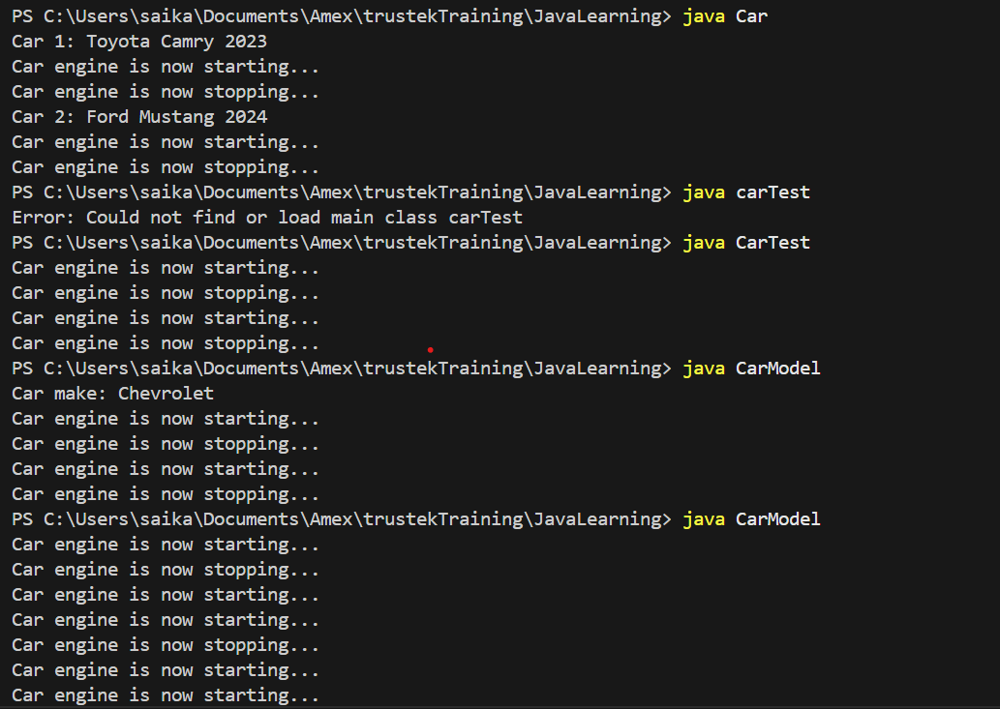

# JavaLearning

Created a Java Constructor and Object
Created methods related to the class
Here I have taken Car Example
Car.java: created constructor directly in the main class, intialized the attributes and using methods like startEngine() and stopEngine() for functionality.
CarTest.java: testing class where objects of the Car class are created and tested in the main method.
CarModel.java: CarModel class provides separate methods for setting and displaying car details. 

Output

Compiling Java Files using javac command

Run the Java Programs using java command 
